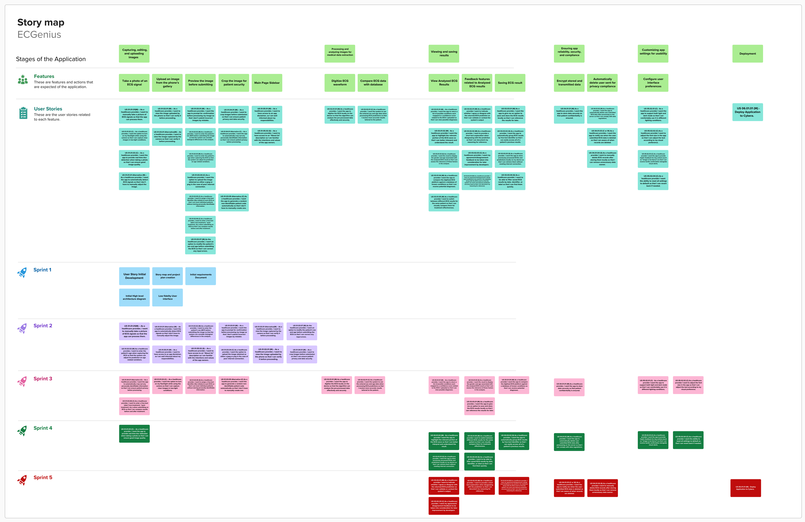

# Project Management

## Story board

## Project Plan

### Sprint 1  
**Due:** Feb 2, 2025  

#### Tasks  
| Task                  | Related US      | Assigned To          | Due Date |
|-----------------------|-----------------|----------------------|----------|
| Storymap             |                 | Brandon, Pooja, Ricardo | Feb 1    |
| Project Plan         |                 | Brandon, Pooja, Ricardo | Feb 1    |
| Architecture Diagram |                 | Mohamed              | Feb 1    |
| User Stories         |                 | Brandon, Pooja, Ricardo | Feb 1    |
| Canvas               |                 | All Members          | Feb 1    |
| Similar Products     |                 | Abdullah             | Feb 1    |
| Figma                |                 | Hassan               | Feb 1    |
| Setting Up Repository |                 | Mohamed              | Feb 1    |

---

### Sprint 2  
**Due:** Feb 16, 2025  

#### User Stories  
| User Story ID            | Description                                                                                                                                      | Story Points |
|--------------------------|--------------------------------------------------------------------------------------------------------------------------------------------------|--------------|
| US 01.01.01 (M)          | As a healthcare provider, I want to manually take a picture of ECG signals so that the app can process them.                                     | 3            |
| US 01.01.01 Alternative (M) | As a healthcare provider, I want the app to automatically detect ECG signals so that I don’t have to manually adjust the image.                | 5            |
| US 01.03.02 (M)          | As a healthcare provider, I want to enter the patient’s sex (M/F) before submitting the image so that the system can consider biological differences. | 1 |
| US 01.03.01 (M)          | As a healthcare provider, I want the app to prompt for confirmation before processing my image so that I don’t submit incorrect images by mistake. | 1 |
| US 01.03.01 Alternative (M) | As a healthcare provider, I want to view the image captured by the camera so that I can verify it before proceeding.                          | 1 |
| US 01.03.07 (M)          | As the healthcare provider, I want an option to modify the patient’s sex and age before submitting the ECG so that I can correct any input errors. | 1 |
| US 01.03.03 (M)          | As a healthcare provider, I want to enter the patient’s age when capturing the ECG so that the system can adjust its prediction for age variations. | 1 |
| US 01.05.01 (M)          | As a healthcare provider, I want to have access to an app disclaimer, so I am well informed about my responsibilities.                           | 1 |
| US 01.05.02 (S)          | As a healthcare provider, I want to have access to an “About Us” description so I am familiar with the app's values and intentions.               | 1 |
| US 01.03.04 (C)          | As a healthcare provider, I want the option to upload images as jpeg or png in case of poor internet connection.                                 | 3 |
| US 01.02.01 (M)          | As a healthcare provider, I want to view the uploaded image so that I can verify it before proceeding.                                           | 2 |
| US 01.04.01 (M)          | As a healthcare provider, I want to crop images before submission to ensure patient privacy and data security.                                   | 3 |

#### Tasks  
| Task                     | Related US       | Assigned To          | Due Date |
|--------------------------|------------------|----------------------|----------|
| Initial Website Layout   |                  | Hassan, Pooja        | Feb 7    |
| Upload Images            | US 01.01.01     | Hassan               | Feb 9    |
| Upload Biological Sex    | US 01.03.02     | Pooja                | Feb 9    |
| Upload Age               | US 01.03.03     | Pooja                | Feb 9    |
| Analyze ECG Images       |                  | Abdullah             | Feb 16   |
| Set Up Flask Backend     |                  | Mohamed              | Feb 10   |
| Set Up Initial Database  |                  | Ricardo              | Feb 10   |
| Create "About Us" Page   | US 01.05.02     | Brandon              | Feb 10   |
| Add Disclaimer           | US 01.05.01     | Rithwik              | Feb 10   |
| Add Crop Image Feature   | US 01.04.01     | Ricardo              | Feb 14   |

---

### Sprint 3  
**Due:** Mar 9, 2025  

#### User Stories  
| User Story ID            | Description                                                                                                                                      | Story Points |
|--------------------------|--------------------------------------------------------------------------------------------------------------------------------------------------|--------------|
| US 01.04.01 Alternative (C) | As a healthcare provider, I want the app to automatically crop out personally identifiable information to ensure patient privacy.             | 5 |
| US 01.01.02 (C)          | As a healthcare provider, I want the option to turn on my flashlight while using the camera for better image capture in low-light conditions.   | 2 |
| US 01.03.05 (S)          | As a healthcare provider, I want to assign a free-text identifier (like initials) to each ECG for patient tracking without storing identifiable info. | 3 |
| US 01.03.05 Alternative (C) | As a healthcare provider, I want the app to generate a random non-identifiable patient code automatically.                                    | 2 |
| US 01.03.06 (C)          | As a healthcare provider, I want to enter a free-text label (“pre-treatment”, “post-treatment”, etc.) to compare results.                        | 3 |
| US 02.01.01 (M)          | As a healthcare provider, I want the app to digitize the ECG locally for secure and effective data analysis.                                     | 5 |
| US 02.02.01 (C)          | As a healthcare provider, I want the system to use the entered sex and age data for more accurate ECG predictions.                              | 3 |
| US 03.01.01 (M)          | As a healthcare provider, I want the app to return possible conditions with confidence scores for the uploaded ECG.                              | 2 |
| US 03.01.03 (S)          | As a healthcare provider, I want the result to display the gender and age associated with the analyzed ECG.                                     | 2 |
| US 03.01.04 (M)          | As a healthcare provider, I want the app to compare digitized ECGs against a known conditions database for diagnosis.                           | 5 |
| US 03.03.01 (M)          | As a healthcare provider, I want the app to allow saving ECG results locally for future reference.                                              | 2 |
| US 04.01.01 (M)          | As a healthcare provider, I want the app to store data securely to ensure patient confidentiality.                                              | 3 |
| US 05.02.01 (C)          | As a healthcare provider, I want the app to support both light and dark mode for comfortable use.                                               | 2 |
| US 05.02.02 (C)          | As a healthcare provider, I want to adjust the font size in the app according to my visual preference.                                          | 2 |

**Estimated Sprint Velocity:** ...  

#### Tasks  
Sprint 3 tasks will be added during Sprint 2.  

---

### Sprint 4  
**Due:** Mar 23, 2025  

#### User Stories  
| User Story ID            | Description                                                                                                              | Story Points |
|--------------------------|--------------------------------------------------------------------------------------------------------------------------|--------------|
| US 01.01.03 (C)          | As a healthcare provider, I want the app to provide real-time blur detection when taking a photo to ensure good quality. | 5 |
| US 03.01.02 (M)          | As a healthcare provider, I want the app to highlight the relevant portion of the ECG wave for better interpretation.    | 3 |
| US 03.01.05 (M)          | As a healthcare provider, I want to switch between different ECG results for the same patient to compare effectiveness.  | 2 |
| US 03.03.02 (S)          | As a healthcare provider, I want the app to group ECG results by free-text identifier for easy access.                   | 3 |
| US 03.03.03 (S)          | As a healthcare provider, I want the app to store processed ECGs locally for offline retrieval.                           | 2 |
| US 03.03.04 (S)          | As a healthcare provider, I want to filter saved ECG results by date, identifier, or label for quick retrieval.         | 2 |
| US 04.01.02 (M)          | As a healthcare provider, I want the app to delete submitted ECG data post-processing to comply with regulations.        | 1 |
| US 05.02.03 (C)          | As a healthcare provider, I want haptic feedback for key actions like “image is too blurry” for tactile confirmation.    | 3 |
| US 05.02.04 (C)          | As a healthcare provider, I want to reset all settings to default if needed.                                             | 2 |

**Estimated Sprint Velocity:** ...  

#### Tasks  
Sprint 4 tasks will be added during Sprint 3.  

---

### Sprint 5  
**Due:** Apr 1, 2025  

#### User Stories  
| User Story ID            | Description                                                                                                        | Story Points |
|--------------------------|--------------------------------------------------------------------------------------------------------------------|--------------|
| US 03.02.01 (M)          | As a healthcare provider, I want to indicate agreement or disagreement with ECG predictions to validate results.   | 1 |
| US 03.02.02 (M)          | As a healthcare provider, I want to provide a short text explanation when disagreeing to document reasoning.       | 1 |
| US 03.02.04 (M)          | As a healthcare provider, I want my feedback stored with ECG results to improve system accuracy.                   | 5 |
| US 03.02.03 (C)          | As a healthcare provider, I want my feedback considered for system improvement by developers.                      | 5 |
| US 04.01.03 (C or W)     | As a healthcare provider, I want a notification when ECG data is deleted for awareness.                            | 1 |
| US 04.01.04 (S)          | As a healthcare provider, I want to manually delete stored ECG records for data management.                        | 1 |
| US 06.01.01 (M)          | Deploy application to Cybera.                                                                                      | 5 |

**Estimated Sprint Velocity:** ...  

#### Tasks  
Sprint 5 tasks will be added during Sprint 4.  