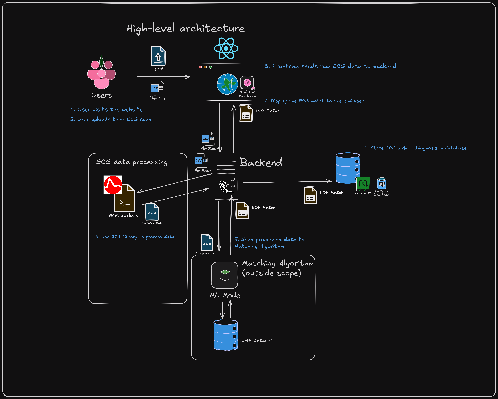
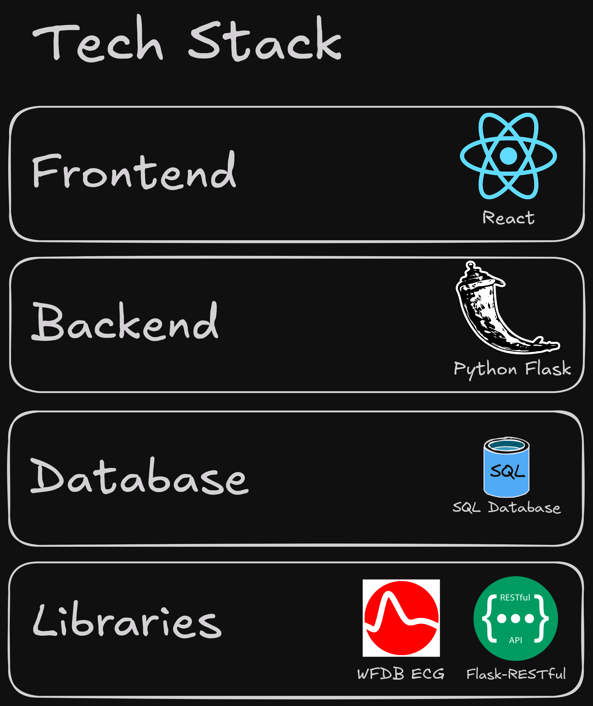
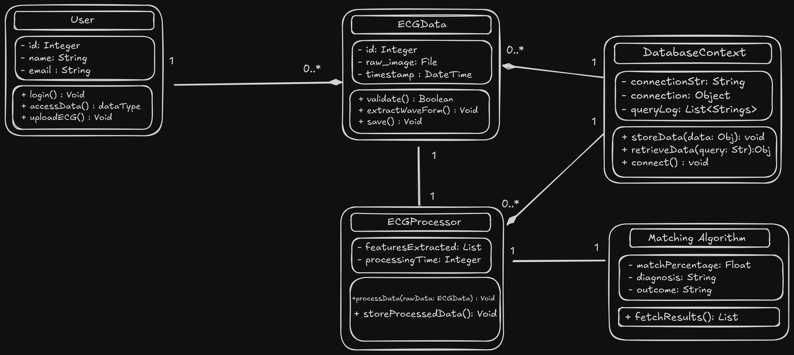
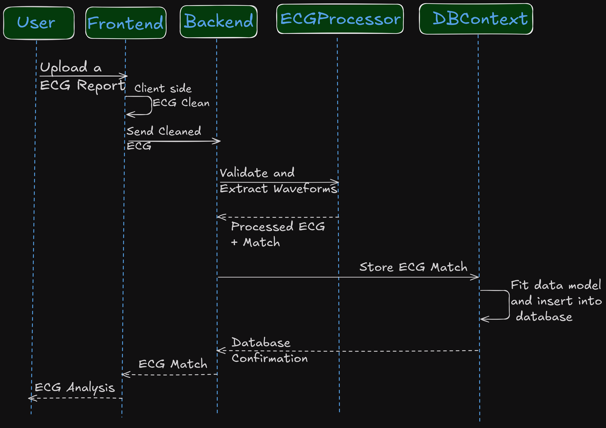
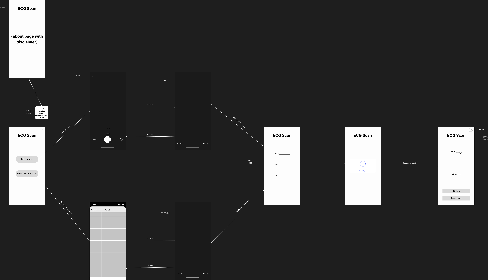

# ECGscan - Software Design Document

## High Level Architecture

## Tech Stack

### Portential Libraries:
- [Flask-RESTful Documentation](https://flask-restful.readthedocs.io/en/latest/) - RESTful HTTP
- [WFDB Python Library](https://physionet.org/content/wfdb-python/4.1.0/) - ECG Analysis Library
- [SQLite3](https://www.sqlite.org/) - Potential Database solution

## Major Data Elements

## Interaction Scenerio

## Low-fidelity user interface
