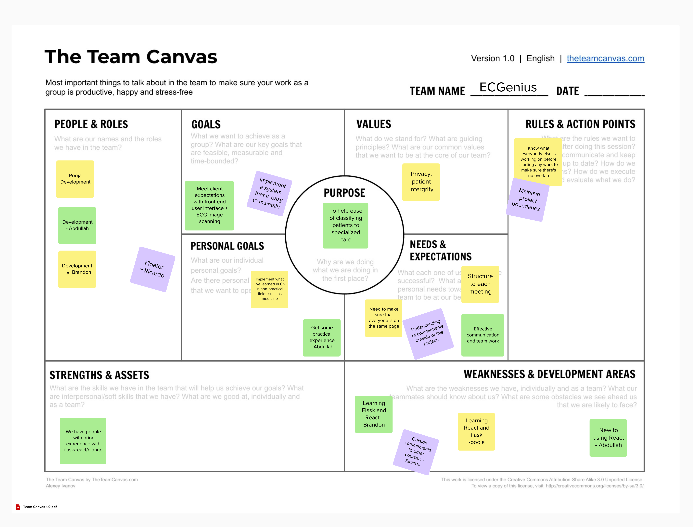

# ECGscan - Team Work Document

## Team Canvas

## Scrum Roles

- Scrum Master : Hassan
- Product Owner : Mohamed

## Belbin Team Roles

- **Brandon**: Implementer
- **Hassan**: Shaper
- **Mohamed**: Specialist
- **Abdullah**: Implementer
- **Ricardo**: Plant
- **Rithwik**: Shaper

| Names      | Preferred Roles     | Manageable Roles | Least Preferred Roles |
|------------|---------------------|------------------|------------------------|
| Brandon    |   IMP, TW, SP     |   CO, SH, PL               |     ME, RI, CF                   |
| Hassan     | SH, IMP, TW         | CF, RI, CO       |   SP, ME, PL      |
| Mohamed    | SP, IMP, CO         | TW, SH, PL       | ME, RI, CF            |
| Abdullah   | IMP, ME, TW         | SP, CO, CF       | SH, RI, PL            |
| Rithwik    |  IMP,CF,SH   |PL, TW, SP      |   ME, RI, CO    |
| Ricardo    | PL, TW, RI          | ME, SP, IMP      | CF, CO, SH            |
| Pooja      | TW, ME, SP          | SH, IMP, CO      | CF, PL, RI            |

# Belbin Team Roles

## Thinking Roles

### PL (Plant)
Tends to be highly creative and good at solving problems in unconventional ways.  
**Ricardo** (preferred)  
**Rithwik** (manageable)  
**Brandon** (manageable)

### ME (Monitor Evaluator)
Provides a logical eye, making impartial judgments where required and weighs up the team's options in a dispassionate way.  
**Pooja** (preferred)  
**Abdullah** (manageable)  
**Brandon** (least preferred)

### SP (Specialist)
Brings in-depth knowledge of a key area to the team.  
**Mohamed** (preferred)  
**Pooja** (manageable)  
**Rithwik** (manageable)  
**Brandon** (preferred)

## Action Roles

### SH (Shaper)
Provides the necessary drive to ensure that the team keeps moving and does not lose focus or momentum.  
**Hassan** (preferred)  
**Rithwik** (preferred)  
**Pooja** (manageable)  
**Ricardo** (manageable)  
**Brandon** (manageable)

### IMP (Implementer)
Needed to plan a workable strategy and carry it out as efficiently as possible.  
**Brandon** (preferred)  
**Abdullah** (preferred)  
**Rithwik** (manageable)

### CF (Completer Finisher)
Most effectively used at the end of tasks to polish and scrutinize the work for errors, subjecting it to the highest standards of quality control.  
**Rithwik** (preferred)  
**Pooja** (manageable)  
**Abdullah** (manageable)  
**Brandon** (least preferred)

## People Roles

### RI (Resource Investigator)
Uses their inquisitive nature to find ideas to bring back to the team.  
**Ricardo** (manageable)  
**Brandon** (least preferred)

### TW (Teamworker)
Helps the team to gel, using their versatility to identify the work required and complete it on behalf of the team.  
**Pooja** (preferred)  
**Brandon** (preferred)

### CO (Co-ordinator)
Needed to focus on the team's objectives, draw out team members and delegate work appropriately.  
**Mohamed** (preferred)  
**Pooja** (manageable)  
**Brandon** (manageable)

## Meeting Minutes

### Meeting Date: 2025/01/21

#### Meeting Summary:
- Discussed reason for the development of this project.
- Web interface (why we don’t want to develop a native app).
- No database, we are responsible for the matching algorithm.
- Specifically, we will create a function `match_ecg(digitized_ecg)` which will return the output as a dictionary (to be defined). You can assume this function exists and works as intended. Your job is to build the plumbing around this.

#### TODOS:
- When2meet: [https://www.when2meet.com/?28546438-lWcEK](https://www.when2meet.com/?28546438-lWcEK)
- Shared doc (see this doc)

#### QUESTIONS:

---

### Meeting Date: 2025/01/27

#### Meeting Summary:
- Divided roles for Software Design, Project Management, and Project Requirements.
- Divided Scrum Roles:
  - **Scrum Master** - Hassan
  - **Product Owner** - Mohamed
- Listed Belbin team roles.

#### TODOS:
- **Pooja, Brandon & Ricardo:** Project Management (Story Map, Project Plan, User Stories)
- **Rithwik:** Executive Summary, User Stories
- **Abdullah:** Similar Products/Open-Source Products/Technical Resources
- **Mohamed:** High-level Architecture
- **Hassan:** Low-fidelity User Interface
- **General:** Figure out Canvas - *Solved.*

#### QUESTIONS:
- Will there be a differentiated user interface based on the user’s role such as doctors, nurses, etc., or will there be a single user interface?
  - **Answer:** Single.
- We are assuming that there is no centralized “admin” user, due to a potential breach of privacy.
  - **Answer:** No need for frontend admin user interface.
- Do they want multiple language support, since they mentioned that English is not the first language of some?
  - **Answer:** No need, just have it in mind. Use simple English.
- Do you want the user to have the option to take a photo, upload from camera roll, or both?
  - **Answer:** Both, just checked.
- Are there any additional features that weren’t in the original scope that you want us to implement as well?
  - **Answer:** Deployment.
- Do we need some sort of disclaimer for the information the app provides? Such that the final diagnosis is up to user discretion?
  - **Answer:** About and disclaimer section under menu dropdown.

---

### Meeting Date: 2025/01/28

#### Meeting Summary:
- Presented tech stack.
- Discussion regarding hosting (going to use Cybera(?) for now with instructions to deploy later).
- Lossy vs Lossless:
  - **Decision:** Lossless for now. May add a feature to allow switching later.
- Presented steps - *All look good.*
- Need to ensure no PII is transferred.
  - Either process on device.
  - Or allow for user to crop.